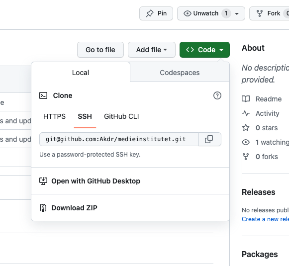

# medieinstitutet

Gruppuppgift 1

Projektet ska innehålla:

2 html filer som är länkade till varandra.
1 CSS 

- Företagsnamn
- Beskriver vad ni har för tjänster
- Prislista
- En bild på var och en i gruppen

Bonus:
- Kontaktformulär
- Text om vardera medlem
- Minst en commit per person i gruppen

Gruppuppgift 2

Projektet ska innehålla (utöver Gruppuppgift 2):

- 1 Javascript fil

Projektet ska ha följande:

- Lägg till en knapp som ändrar bakgrundsfärgen på sidan. 
- Lägg till en enkel klocka som visar aktuell tid med hjälp av JavaScript. Ta hjälp av Date-objektet i Javascript.

Bonus: 
- Lägg till validering av kontaktformuläret med JavaScript så att fälten måste fyllas i korrekt innan det kan skickas. Validera att fälten är ifyllda.
- Lägg till en "räkneverktyg"-funktion där användaren kan ange två tal och få summan visad på sidan.

Gemensamuppgift 1

### Uppgift:

Bygg en sida som visar en lista med djurbilder och fakta.

### Funktionalitet:

Hämta en array med djurobjekt i JavaScript (bild, namn, ålder, etc)
Loopa arrayen och skapa HTML-element för varje djur
Lägg till elementen i DOM:en
Lägg till en click-lyssnare på varje djur
När ett djur klickas, visa dennes fakta i en sidebar
### Tekniker:

#### HTML:

Main för innehåll
- Section för djurlistan
- Aside för sidebar

#### CSS:

- Stila sidan med flexbox eller CSS grid
- Style för aktivt djur

#### JavaScript:

- Array med djurobjekt
- for-loop för att skapa HTML-element
- appendChild för att lägga till i DOM
- addEventListener för klick
- innerHTML eller textContent för att uppdatera sidebar
- Detta övar på att kombinera de olika teknikerna och skapa en interaktiv sida med dynamiskt innehåll. 

Börja med att planera uppdelningen och flödet.

Github

# Github:

Inne på erat repository så finns det Settings. Där inne klickar ni på Collaborators och bjuder in er gruppmedlem så den kan se er kod.

Bjud gärna in mig på användarnamn: Akdr

För att klona en annans repo:
- Använd github desktop
- Klicka på Add -> Clone Repository
- Ta länken  via "Code" på github.com
- Klistra in i URL rutan i Github Desktop
- Byt namn på mappen i Path till medieinstutitet-grupp

