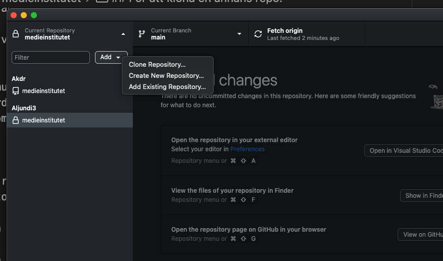
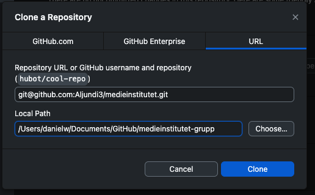

# medieinstitutet

## Gruppuppgift 1

Projektet ska innehålla:

2 html filer som är länkade till varandra.
1 CSS 

- Företagsnamn
- Beskriver vad ni har för tjänster
- Prislista
- En bild på var och en i gruppen

Bonus:
- Kontaktformulär
- Text om vardera medlem
- Minst en commit per person i gruppen

Github:

Inne på erat repository så finns det Settings. Där inne klickar ni på Collaborators och bjuder in er gruppmedlem så den kan se er kod.

Bjud gärna in mig på användarnamn: Akdr

För att klona en annans repo:
- Använd github desktop
- Klicka på Add -> Clone Repository
- Ta länken  via "Code" på github.com
- Klistra in i URL rutan i Github Desktop
- Byt namn på mappen i Path till medieinstutitet-grupp

